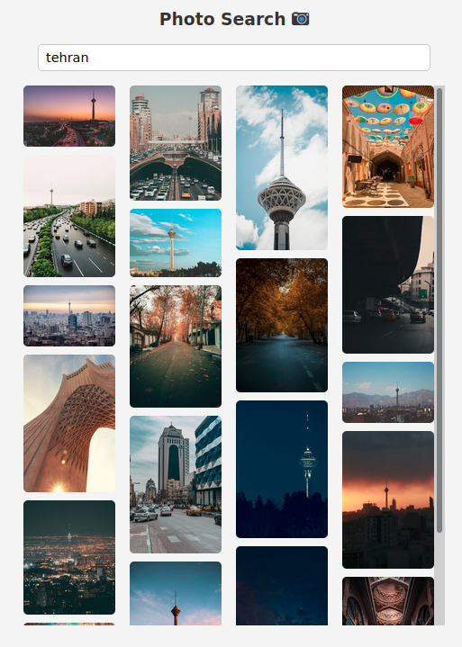

# photo-search

### A photo search application which using unsplash api



## Project setup

#### Before install dependencies, register as a developer in [unsplash](https://unsplash.com/developers)

#### then, create an app and get your access token which it's require for [api calling](./src/components/TheSearchForm.vue#L15)

### Install dependencies
```
yarn install
```

### Compiles and hot-reloads for development

```
yarn serve
```

### Compiles and minifies for production

```
yarn build
```

### Lints and fixes files

```
yarn lint
```